# Hey, I'm Oliver Rivera 👋

Final-year Software Engineering student at Ensign College. Full-stack developer with a background in Mechatronics and Design. Currently building with Java, Python, React, and FastAPI and actively looking for internship opportunities.

- Currently working on a FIFA World Cup 2026 simulator and an AI documentation tool
- Deepening my knowledge in cloud architecture, system design, and AI integration
- Came up through Mechatronics and Design before switching to software. I think in systems
- Bilingual in English and Spanish

 

### Tech Stack

**Languages**

**Frontend**

**Backend**

**Data & Cloud**

**AI / ML**

 

### GitHub Stats

<picture>
  <source media="(prefers-color-scheme: dark)" srcset="./profile/stats-dark.svg" height="160"/>
  
</picture>
<picture>
  <source media="(prefers-color-scheme: dark)" srcset="./profile/langs-dark.svg" height="160"/>
  
</picture>

 

### Featured Projects

#### [World Cup 2026: Path to Glory](https://github.com/olael94/world-cup-2026-path-to-glory)
Full-stack FIFA World Cup tournament simulator. Users predict group-stage outcomes; the app runs a complete 104-match simulation using ELO-based win probability and Poisson regression for scoreline prediction. Integrated LangChain + GPT with live web search to generate AI scouting reports for all 48 teams — ~240 news signals per refresh, cached 24h.

 

#### [DocRelief AI](https://github.com/olael94/docrelief-ai)
AI-powered documentation generator built with a cross-functional team under Agile/Scrum. Serving as Product Owner, I owned the backlog, sprint planning, and product direction while contributing to the full-stack implementation.

 

#### [Spring Boot Banking REST API](https://github.com/olael94/spring-boot-banking-rest-api)
Production-style REST API with full CRUD, JWT auth, and AWS RDS PostgreSQL backend. Environment variables protect credentials; designed with layered architecture and test coverage.

 

### Connect

<a href="https://www.linkedin.com/in/oliver-rivera-dev">
  <picture>
    <source media="(prefers-color-scheme: dark)" srcset="./profile/linkedin-white.svg"/>
    
  </picture>
</a> &nbsp;&nbsp;
<a href="https://github.com/olael94">
  <picture>
    <source media="(prefers-color-scheme: dark)" srcset="./profile/github-white.svg"/>
    
  </picture>
</a> &nbsp;&nbsp;
<a href="https://oliver-rivera-portfolio.vercel.app/#projects">
  <picture>
    <source media="(prefers-color-scheme: dark)" srcset="./profile/portfolio-white.svg"/>
    
  </picture>
</a>

 
 

*Open to software engineering internship opportunities — Summer/Fall 2026.*
